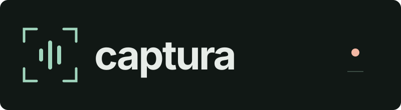
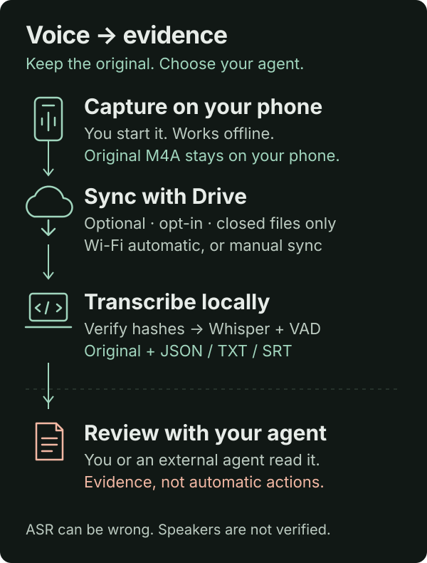

<p align="center">
  
</p>

# Captura

**Say it. Keep the original. Choose your agent.**

**Your phone as a voice-input pipeline for the agent you choose.**

A small, self-hosted experiment to share an idea, not a hosted product or a business.
Android records visible, user-started audio; optional Drive sync moves closed chunks;
a local worker verifies originals and transcribes with whisper.cpp + voice activity
detection (VAD). You or your external agent read the results and review the evidence.

## From voice to evidence

<p align="center">
  
</p>

**Capture → optional sync → local transcription → review.** The original stays
available throughout. Drive moves closed files, not a live microphone stream.
USB and wireless debugging are development/install tools, not requirements for
recording or Drive sync.

No embedded agent, subscriptions, mandatory Codex/OpenClaw connection, analytics,
automatic task creation or execution of spoken instructions. No special hardware.
VAD reduces noise-fed ASR, but cannot identify speakers or guarantee accurate text.

## Try the interface without Google or a model

Python 3.10+; no Python packages required:

```sh
python3 bin/capture list --root examples/demo
python3 bin/capture read demo_idea --root examples/demo
python3 bin/capture view --root examples/demo --output /tmp/captura-demo
```

Open `/tmp/captura-demo/index.html`. The example is **hand-authored, fictional text**,
not a real recording or a claimed ASR result. The viewer is offline, dark and has no
external assets. To review real audio it copies the original into the output folder;
that folder is sensitive and must never be published casually.

## Build / run the actual pipeline

- [Android](docs/android.md): Android 10+, JDK 17, SDK 36; build a new debug app.
- [Worker](docs/worker.md): macOS reference setup, rclone, ffmpeg, whisper.cpp and models.
- [Agent integration](docs/agent-interface.md): read-only CLI and versioned record format.
- [Privacy](docs/privacy.md): permissions, cloud copies and review boundaries.
- [Origins and licenses](NOTICE.md).
- [Local verification and limitations](docs/verification.md).

```sh
ANDROID_HOME=/path/to/android-sdk ./android/build.sh
python3 -m unittest discover -s worker -v
python3 -m unittest discover -s tests -v
```

Each person supplies their own OAuth configuration, signing identity and local model.
Google linking is **not** ready-to-use through a shared project. Android's Drive scope
is `drive.file`; desktop authorization is separately configured and may be broader.
The first supported reference combination is **Android + macOS**. Other desktops and
phones have not been validated. Background recording/sync is subject to Android policy.

## What is here

`android/` recorder, quick tile, Drive upload queue, local battery observations;
`worker/` GET-only Drive importer, local ASR, receipts/retries/quarantine;
`viewer/` reader template; `bin/capture` read-only agent CLI;
`examples/` fake config and fictional demo; `tests/`, `docs/`.

## Status / contribution

Open-source prototype; source code is public, not a production-ready app release. Contributions should make the bridge
simpler or more reliable, not add a personal secretary or SaaS. Before any release:
review licenses and dependency notices, build from clean checkout, configure a new
OAuth/signing identity and test on a separate phone. No production credentials,
private audio or private transcript is included. See [release checklist](docs/release.md).

MIT for repository code; third-party tools/dependencies keep their own licenses.

### New prototype: local voice and short notes

The Android home screen now separates **recording**, **listening without saving**
and **microphone off**. Optional offline controls require the model and explicit opt-in.
For a short reviewable note: **“Lobo, anotá” → cue → dictate → “Lobo, listo”**.
This captures evidence, not a task-executing assistant. See
[setup, privacy, and unverified hardware limits](docs/voice-notes.md).
